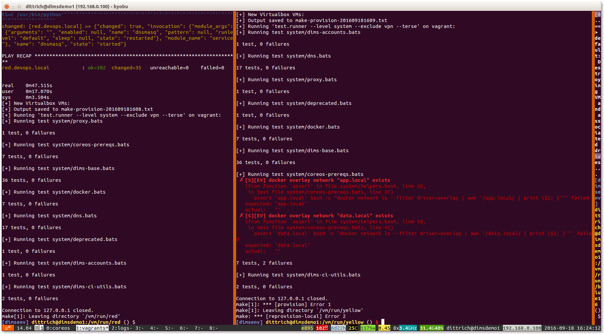

.. _appendices:

Appendices
==========

This appendix describes:

#. How to create a VM for Dashboard server and API component interface tests,
   Dashboard UI-based tests
#. How to create a Tupelo server VM for Tupelo tests
#. How to install Tupelo client
#. How to plan tests with JIRA
#. How to use the test report generation scripts in the ``$GIT/dims-tr`` repo.
#. How to use ``bats`` for producing and executing tests

.. _dashboardtestserver:

Test Dashboard server VM
------------------------

Tests performed using the Dashboard user interface, as well as some of the
automated tests, require a Vagrant test server VM running on the tester's
workstation.

Whenever a test has a prerequisite of ``dashboard test server``, it is
referring to this VM, up and running on the tester's workstation.

Creating the VM
~~~~~~~~~~~~~~~

To create this VM, do the following:

.. _installboxfile:

1. The Vagrant box ``ubuntu-14.04.2-amd64-base-keyed`` should be installed in Vagrant.
   This box is created by the procedure described at :ref:`dimspacker:vmquickstart`.
   If you have already performed those steps, through the subsection
   :ref:`dimspacker:vmquickstartinstallboxes`, then you've already installed
   this box file. You can also check by:

   .. code-block:: none

       vagrant box list

   ..

   If ``ubuntu-14.04.2-amd64-base-keyed`` appears in the list, then you already
   have this box file installed, and you can go to the next step. If it is not
   installed, perform the steps at :ref:`dimspacker:vmquickstart` through the
   box installation step at :ref:`dimspacker:vmquickstartinstallboxes`.

..

2. Set up Vagrant directory for the VM you're creating. You will need to
   name the VM - the name ``dimstestserver is used in the code below
   and will be used in Test prerequisite steps.
   Then you will add a private IP
   address to the auto-generated Vagrantfile. We are specifying the IP to be used
   for testing as ``192.168.56.103.`` Finally, bring the VM up using ``vagrant up``.

   .. code-block:: none

      cd $GIT/dims-vagrant/ubuntu-14.04.2-amd64/
      make server NAME=dimstestserver
      cd dimstestserver
      ../nic2 192.168.56.103
      vagrant up

   ..

..

3. Run the Ansible playbook ``dims-test-server-provision.yml`` as shown below. This will
   take a while to run since it will install the virtual environment. Once this is done, you
   can reuse the VM for multiple tests without destroying it.

   .. code-block:: none

       ./run_playbook -g dashboard-test-servers dims-test-server-provision.yml -vv

   ..

..

Resetting VM Data
~~~~~~~~~~~~~~~~~

A test prerequisite may specify that you reset the test VM's data. To do this, you run
the ``dashboard-test-data-reset`` playbook as follows. CD to the VM's Vagrantfile
directory as shown in the first step if you aren't there already.

.. code-block:: none

    cd $GIT/dims-vagrant/ubuntu-14.04.2-amd64/dimstestserver
    ./run_playbook -g dashboard-test-servers dashboard-test-data-reset.yml -vv

..

.. _creatingtupeloserver:

Creating Tupelo server VM
-------------------------

Tupelo tests require a Tupelo server VM.

This server is created in a similar fashion to the dashboard test server:

1. Make sure you have the box file installed as shown above in step one of creating
   a dashboard test server.

..

2. Set up Vagrant directory for the VM, name it ``tupeloserver`` and
   give it an IP of ``192.168.56.102``.

   .. code-block:: none

      cd $GIT/dims-vagrant/ubuntu-14.04.2-amd64/
      make server NAME=tupeloserver
      cd tupeloserver
      ../nic2 192.168.56.102
      vagrant up

   ..

..

3. Run the Ansible playbook ``tupelo-test-server-provision.yml`` as shown below.

   .. code-block:: none

       ./run_playbook -g tupelo-servers tupelo-server-install.yml -vv

   ..

..

.. _installingtupeloclient:

Installing Tupelo client
------------------------

The tester needs the Tupelo client installed on their host machine to perform many of the Tupelo tests.
The tester installs the tupelo client on his/her developer workstation via Ansible:

.. code-block:: none

    RUNHOST=localhost RUNGROUP=tupelo-clients ansible-playbook -i $GIT/ansible-playbooks/dyn_inv.py $GIT/ansible-playbooks/tupelo-shell-deploy.yml -e artifact_branch=develop --ask-sudo-pass -vv

..

.. _jiratestplanner:

Planning tests with JIRA
------------------------

This section describes how to plan a test cycle and write tests using JIRA.

Test cycle
~~~~~~~~~~

We use a test cycle to plan and execute our tests. To view test cycles,
click ``Tests > Plan Test Cycle``:

.. _testCycles:

.. figure:: images/jira/plan_cycle1.png
    :alt: View test cycles
    :width: 100%

..

The list of cycles displays. We need a new cycle for the tests due on
11/15, so we'll create one. Click the ``Create New Cycle`` button to bring up
a dialog to create the cycle. Give it a name and description.

.. figure:: images/jira/create_cycle1.png
    :alt: View test cycles
    :width: 100%

..

The new test cycle displays in the list. You can see that it doesn't have any
tests yet.

.. figure:: images/jira/create_cycle2.png
    :alt: View test cycles
    :width: 100%

..

When you create a test in JIRA, you will add it to this test cycle.

Creating tests
~~~~~~~~~~~~~~

To create a new test, select ``Tests > Create a Test``.

.. figure:: images/jira/create_issue1.png
    :alt: View test cycles
    :width: 100%

..

The Create Issue screen displays, with the issue type already set to Test.
Enter a summary for the test, and fill in choices in the testLevel, testClass, and
qualificationMethod pick boxes. These are described in this Test Plan. Choose one item
per pick box. You should also
add the reference to the DIMS SR - these are referenced in Section 4 of this plan for each
group of planned tests. typeOfData describes where the output data will be when
you are done. You can add this later if you don't know it at this time.

..  todo(lparsons): Update screen shot
.. todo::

    Need to update to screenshot only showing one selection per item

..

The following figure shows the first part of the Create Issue dialog being filled
in:

.. figure:: images/jira/create_issue2.png
    :alt: View test cycles
    :width: 100%

..

Scrolling down, you describe the Environment and provide a Description of the test.
The environment entry should be short. If the test needs a local Vagrant VM to run,
then the Test should reference how that is created in the prerequisites.

We enter prerequisites in the first test step. When you initially create the test, you can just add
a short description and add prerequisites by editing the test.

.. figure:: images/jira/create_issue3.png
    :alt: View test cycles
    :width: 100%

..

Save the test. You can further fill out fields by editing the test. For example,
you can upload files needed to run the test. In this example, we are uploading a
file with test data and a script which will run a number of automated tests using
the test data file as input:

.. figure:: images/jira/upload_files.png
    :alt: View test cycles
    :width: 100%

..

If files aren't attached, the prerequisites should state where to get them.

Add the test to the desired test cycle. Select More Actions > Add to Test Cycle(s):

.. figure:: images/jira/add_to_test_cycle1.png
    :alt: View test cycles
    :width: 100%

..

Select the test cycle. In this example, we choose the Sample Test Cycle. You would
choose the 2015-100-15_test_report test cycle for actual tests.

.. figure:: images/jira/add_to_test_cycle2.png
    :alt: View test cycles
    :width: 100%

..

The test will now show up in the list of tests for that test cycle. The E button
on the right is the button to click when you are going to execute the test.

.. figure:: images/jira/add_to_test_cycle3.png
    :alt: View test cycles
    :width: 100%

..

To create more tests, you can do so from scratch, or you can clone an existing
test. Go to the existing test, and click Clone.

.. figure:: images/jira/clone_test1.png
    :alt: View test cycles
    :width: 100%

..

Enter a new summary for the new test. You can clone attachments if the same ones
are used for the new test.

.. figure:: images/jira/clone_test2.png
    :alt: View test cycles
    :width: 100%

..

Here is an updated Sample test 2. Prerequisite info has been added to the
description. The comment regarding "if test fails" isn't needed - that was put in
before we had the typeOfOutput field (will update this screenshot later);

Since this test is automated, we just have one step - to run the test script.
The Expected Result is given as how many tests should pass.

.. todo::

    Not sure the best way to do the automated tests in JIRA. In this method, if
    one out of the 12 tests fail, the failing test item isn't shown on the ticket.
    The test output will need to be inspected. (The failed portion could be noted
    in the comments during execution however - see below).

..

.. figure:: images/jira/sample_test_2_updated.png
    :alt: View test cycles
    :width: 100%

..

.. figure:: images/jira/execute_test1.png
    :alt: View test cycles
    :width: 100%

..

.. figure:: images/jira/execute_test2.png
    :alt: View test cycles
    :width: 100%

..

.. figure:: images/jira/failed_test1.png
    :alt: View test cycles
    :width: 100%

..

.. figure:: images/jira/new_test_execute1.png
    :alt: View test cycles
    :width: 100%

..

.. figure:: images/jira/new_test_execute1.png
    :alt: View test cycles
    :width: 100%

..

.. _generatingTestReport:

Generating a Test Report with the report generation utility
-----------------------------------------------------------

.. TODO(dittrich): clean this up... quick hack instructions

.. note::

    .. todo::

        These are quick-hack instructions copied from an email to
        the group about changes made on 2015-11-19 in preparation
        for the Test Report deadline on the 23rd. They need to
        be cleaned up.

    ..

..

A Test Report is produced using a reporting utility that generates
a Sphinx document, based on source from the ``$GIT/dims-tr``
Git repository directory. It processes metadata descriptions of
tests and their results, producing a Sphinx document.

Test cycles are named with a date, e.g., ``2015-11-15``.
A simple directory structure is used that combines test results
from both test managed within Jira using Zephyr for Jira, as
well as non-Jira test results. Both of these sources are rooted
at ``$GIT/dims-tr/test_cycles`` along with a copy of the
Sphinx document skeleton found in the ``$GIT/dims-tr/docs`` directory.
This separates the report and data from which the report was
generated for each test cycle into its own directory tree. For
example,

.. code-block:: none

    [dimscli] dittrich@27b:~/dims/git/dims-tr/test_cycles
    (feature/dims-529*) $ tree
    .
    ├── 2015-11-15
    │   ├── docs
    │   │   ├── Makefile
    │   │   ├── build
    │   │   └── source
    │   ├── jira_data
    │   │   ├── DIMS-553.json
    │   │   ├── DIMS-553.pdf
    │   │   ├── DIMS-554.json
    │   │   ├── DIMS-554.pdf
    │   │   ├── DIMS-565.json
    │   │   ├── DIMS-565.pdf
    │   │   ├── DIMS-566.json
    │   │   ├── DIMS-569.json
    │   │   ├── DIMS-570.json
    │   │   ├── DIMS-570.pdf
    │   │   ├── DIMS-571.json
    │   │   ├── DIMS-571.pdf
    │   │   ├── DIMS-574.json
    │   │   └── DIMS-574.pdf
    │   ├── jira_data_summary.json
    │   └── nonjira_data
    │       ├── test1.json
    │       ├── test1.pdf
    │       ├── test2.json
    │       └── test3.json
    └── 2016_00_00
        ├── docs
        │   ├── Makefile
        │   ├── build
        │   └── source
        ├── jira_data
        │   └── blahblah
        ├── jira_data_summary.json
        └── nonjira_data
            └── blahblah

    20 directories, 91 files

..

.. note::

   The  directory ``2016_00_00`` is just an example to show two
   sub-trees, not just one: it does not exist in Git.

..

A file ``$GIT/dims-tr/CURRENT_CYCLE`` contains the test cycle identifier for
the current test cycle (and can be over-ridden with a command line option in
the test utility.)

.. TODO(dittrich): Make sure that option exists...
.. todo::

    Make sure that option exists.

..

It can be used with inline command substitution in the BASH shell
like this:

.. code-block:: none

    [dimscli] dittrich@27b:~/dims/git/dims-tr (feature/dims-529*) $ tree -L
    1 test_cycles/$(cat CURRENT_CYCLE)
    test_cycles/2015-11-15
    ├── docs
    ├── jira_data
    ├── jira_data_summary.json
    └── nonjira_data

    3 directories, 1 file

    [dimscli] dittrich@27b:~/dims/git/dims-tr (feature/dims-529*) $ tree -L
    1 test_cycles/$(cat CURRENT_CYCLE)/jira_data
    test_cycles/2015-11-15/jira_data
    ├── DIMS-553.json
    ├── DIMS-553.pdf
    ├── DIMS-554.json
    ├── DIMS-554.pdf
    ├── DIMS-565.json
    ├── DIMS-565.pdf
    ├── DIMS-566.json
    ├── DIMS-569.json
    ├── DIMS-570.json
    ├── DIMS-570.pdf
    ├── DIMS-571.json
    ├── DIMS-571.pdf
    ├── DIMS-574.json
    └── DIMS-574.pdf

    0 directories, 14 files

..

There is a helper ``Makefile`` at the root of the repo to make it
easier to generate a report.

.. code-block:: none

    dimscli] dittrich@27b:~/dims/git/dims-tr (feature/dims-529*) $ make help
    /Users/dittrich/dims/git/dims-tr
    [Using Makefile.dims.global v1.6.124 rev ]
    ---------------------------------------------------------------------------
    Usage: make [something]

    Where "something" is one of the targets listed in the sections below.

     ---------------------------------------------------------------------------
                     Targets from Makefile.dims.global

     help - Show this help information (usually the default rule)
     dimsdefaults - show default variables included from Makefile.dims.global
     version - show the Git revision for this repo
     envcheck - perform checks of requirements for DIMS development
     ---------------------------------------------------------------------------
                       Targets from Makefile

     all - defaults to 'report'
     showcurrent - show the current test cycle
     enter - enter a test description
     report - generate a 'results.rst' file in ../docs/source/
     autobuild - run dims.sphinxautobuild for this test cycle
     install - install Python script and pre-requisites
     clean - remove build files and generated .rst files.
     spotless - clean, then also get rid of dist/ directory
    ---------------------------------------------------------------------------

    [dimscli] dittrich@27b:~/dims/git/dims-tr (feature/dims-529*) $ make
    showcurrent
    Current test cycle is 2015-11-15

    [dimscli] dittrich@27b:~/dims/git/dims-tr (feature/dims-529*) $ make report
    python scripts/get_test.py

    [dimsenv] dittrich@27b:~/dims/git/dims-tr (feature/dims-529*) $ make
    autobuild
    tar -cf - docs | (cd "test_cycles/2015-11-15" && tar -xf -)
    rm -rf build/*
    [I 151119 21:35:18 server:271] Serving on http://127.0.0.1:48196
    [I 151119 21:35:18 handlers:58] Start watching changes
    [I 151119 21:35:18 handlers:60] Start detecting changes

    +--------- source/test3.rst changed
    ---------------------------------------------
    /Users/dittrich/dims/git/dims-tr/test_cycles/2015-11-15/docs/source/test3.rst::
    WARNING: document isn't included in any toctree
    +--------------------------------------------------------------------------------

    +--------- source/index.rst changed
    ---------------------------------------------
    +--------------------------------------------------------------------------------

    +--------- source/results.rst changed
    -------------------------------------------
    +--------------------------------------------------------------------------------

    [I 151119 21:35:24 handlers:131] Browser Connected: http://127.0.0.1:48196/

..

.. _bats:

Using ``bats`` for Producing and Executing Tests
------------------------------------------------

The DIMS project has adopted use of the `Bats: Bash Automated Testing System`_
(known as ``bats``) to perform simple tests in a manner that produces
parsable output following the `Test Anything Protocol`_ (TAP).

Bats is a **TAP Producer**, whose output can be processed by one of
many `TAP Consumers`_, including the Python program `tap.py`_.

.. _Bats\: Bash Automated Testing System: https://github.com/sstephenson/bats#bats-bash-automated-testing-system
.. _Test Anything Protocol: http://testanything.org
.. _TAP Consumers: http://testanything.org/consumers.html
.. _tap.py: https://pypi.python.org/pypi/tap.py

.. _bats:

Organizing Bats Tests
~~~~~~~~~~~~~~~~~~~~~

This section covers the basic functionality of ``bats`` and
how it can be used to produce test results.

We should start by looking at the ``--help`` output for ``bats`` to understand
how it works in general.

.. code-block:: none

    $ bats -h
    Bats 0.4.0
    Usage: bats [-c] [-p | -t] <test> [<test> ...]

      <test> is the path to a Bats test file, or the path to a directory
      containing Bats test files.

      -c, --count    Count the number of test cases without running any tests
      -h, --help     Display this help message
      -p, --pretty   Show results in pretty format (default for terminals)
      -t, --tap      Show results in TAP format
      -v, --version  Display the version number

      For more information, see https://github.com/sstephenson/bats

..

As is seen, multiple tests -- files that end in ``.bats`` -- can be passed
as a series of arguments on the command line.  This can be either individual
arguments, or a wildcard shell expression like ``*.bats``.

If the argument evaluates to being a directory, ``bats`` will look through that
directory and run all files in it that end in ``.bats``.

.. caution::

    As we will see, ``bats`` has some limitations that do not allow mixing file
    arguments and directory arguments. You can either give ``bats`` one or more
    files, or you can give it one or more directories, but you **cannot mix
    files and directories**.

..

To see how this works, let us start with a simple example that has tests that
do nothing other than report success with their name.  In this case, test
``a.bats`` looks like this:

.. code-block:: bash

    #!/usr/bin/env bats

    @test "a" {
        [[ true ]]
    }

..

We produce three such tests, each in their own directory, following this
organizational structure:

.. code-block:: none

    $ tree tests
    tests
    ├── a
    │   └── a.bats
    └── b
        ├── b.bats
        └── c
            └── c.bats

    3 directories, 3 files

..

Since the hierarchy shown here does not contain tests itself, but rather holds
directories that in turn hold tests, how does we run the tests?

Running ``bats`` with an argument that includes the highest level of the
directory hierarchy does not work to run any of the tests in subordinate
directories:

.. code-block:: none

    $ bats tests

    0 tests, 0 failures

..

Running ``bats`` and passing a directory that contains files with
names that end in ``.bats`` runs all of the tests in *that
directory*.

.. code-block:: none

    $ bats tests/a
     ✓ a

    1 test, 0 failures

..

If we specify the next directory ``tests/b``, then ``bats``
will run the tests in that directory that end in ``.bats``,
but will not traverse down into the ``tests/b/c/`` directory.

.. code-block:: none

    $ bats tests/b
     ✓ b

    1 test, 0 failures

..

To run the tests in the lowest directory, that specific
directory must be given on the command line:

.. code-block:: none

    $ bats tests/b/c
     ✓ c

    1 test, 0 failures

..

Attempting to pass all of the directories along as arguments
does not work, as seen here:

.. code-block:: none

    $ bats tests/a /tests/b tests/b/c
    bats: /tmp/b does not exist
    /usr/local/Cellar/bats/0.4.0/libexec/bats-exec-suite: line 20: let: count+=: syntax error: operand expected (error token is "+=")

..

This means that we *can* separate tests into subdirectories, to
any depth or directory organizational structure, as needed,
but tests must be run on a per-directory basis, or identified
and run as a group of tests passed as file arguments using
wildcards:

.. code-block:: none

    $ bats tests/a/*.bats tests/b/*.bats tests/b/c/*.bats
     ✓ a
     ✓ b
     ✓ c

    3 tests, 0 failures

..

Because specifying wildcards in this way, with arbitrary
depths in the hierarchy of directories below ``tests/``
is too hard to predict, use a program like ``find``
to identify tests by name (possibly using wildcards or
``grep`` filters for names), passing the results on to
a program like ``xargs`` to invoke ``bats`` on each
identified test:

.. code-block:: none

    $ find tests -name '*.bats' | xargs bats
    1..3
    ok 1 a
    ok 2 b
    ok 3 c

..

.. note::

   Note that the output changed from the examples above, which include the
   arrow ("✓") character, to now include the word ``ok`` instead in TAP
   format. This is because the default for terminals (i.e., a program that is
   using a TTY device, not a simple file handle to something like a pipe).  To
   get the pretty-print output, add the ``-p`` flag, like this:

    .. code-block:: none

        $ find tests -name '*.bats' | xargs bats -p
         ✓ a
         ✓ b
         ✓ c

        3 tests, 0 failures

    ..

..

A more realistic test is seen here. This file, ``pycharm.bats``, is the product
of a Jinja template that is installed by Ansible along with the `PyCharm`_ Community
Edition Python IDE.

.. _PyCharm: https://www.jetbrains.com/pycharm/

.. code-block:: bash

    #!/usr/bin/env bats
    #
    # Ansible managed: /home/dittrich/dims/git/ansible-playbooks/v2/roles/pycharm/templates/../templates/tests/./system/pycharm.bats.j2 modified on 2016-09-15 20:14:38 by dittrich on dimsdemo1 [ansible-playbooks v1.3.33]
    #
    # vim: set ts=4 sw=4 tw=0 et :

    load helpers

    @test "[S][EV] Pycharm is not an installed apt package." {
        ! is_installed_package pycharm
    }

    @test "[S][EV] Pycharm Community edition is installed in /opt" {
        results=$(ls -d /opt/pycharm-community-* | wc -l)
        echo $results >&2
        [ $results -ne 0 ]
    }

    @test "[S][EV] \"pycharm\" is /opt/dims/bin/pycharm" {
        assert "pycharm is /opt/dims/bin/pycharm" type pycharm
    }

    @test "[S][EV] /opt/dims/bin/pycharm is a symbolic link to installed pycharm" {
        [ -L /opt/dims/bin/pycharm ]
    }

    @test "[S][EV] Pycharm Community installed version number is 2016.2.3" {
        assert "2016.2.3" bash -c "file $(which pycharm) | sed 's|\(.*/pycharm-community-\)\([^/]*\)\(/.*$\)|\2|'"
    }

..

.. code-block:: none

    $ test.runner --level system --match pycharm
    [+] Running test system/pycharm
     ✓ [S][EV] Pycharm is not an installed apt package.
     ✓ [S][EV] Pycharm Community edition is installed in /opt
     ✓ [S][EV] "pycharm" is /opt/dims/bin/pycharm
     ✓ [S][EV] /opt/dims/bin/pycharm is a symbolic link to installed pycharm
     ✓ [S][EV] Pycharm Community installed version number is 2016.2.3

    5 tests, 0 failures

..

.. _organizingtests:

Organizing tests in DIMS Ansible Playbooks Roles
~~~~~~~~~~~~~~~~~~~~~~~~~~~~~~~~~~~~~~~~~~~~~~~~

The DIMS project uses a more elaborate version of the above example, which
uses a *drop-in* model that allows any Ansible role to drop its own
tests into a structured hierarchy that supports fine-grained test
execution control.  This drop-in model is implemented by the
``tasks/bats-tests.yml`` task playbook.

.. todo::

    Cross-reference the ``ansible-playbooks`` documentation on this task
    file.

..

To illustrate how this works, we start with an empty test directory:

.. code-block:: none

    $ tree /opt/dims/tests.d
    /opt/dims/tests.d

    0 directories, 0 files

..

The ``base`` role has the largest number of tests, since it does
the most complex foundational setup work for DIMS computer systems.
The ``template/tests`` directory is filled with Jinja template
Bash scripts and/or ``bats`` tests, in a hierarchy that includes
subdirectories for each of the defined test levels from Section
:ref:`testlevels`.

.. code-block:: none

    $ tree base/templates/tests
    base/templates/tests
    ├── component
    ├── helpers.bash.j2
    ├── integration
    ├── README.txt
    ├── system
    │   ├── deprecated.bats.j2
    │   ├── dims-accounts.bats.j2
    │   ├── dims-accounts-sudo.bats.j2
    │   ├── dims-base.bats.j2
    │   ├── dns.bats.j2
    │   ├── proxy.bats.j2
    │   ├── sudo
    │   │   └── sudo-iptables.bats.j2
    │   └── user
    │       └── vpn.bats.j2
    └── unit
        └── dims-filters.bats.j2

    6 directories, 11 files

..

After running just the ``base`` role, the highlighted subdirectories that
correspond to each of the test levels are now present in the
``/opt/dims/tests.d/`` directory:

.. code-block:: none
   :emphasize-lines: 3,6,8,21

    $ tree /opt/dims/tests.d/
    /opt/dims/tests.d/
    ├── component
    │   └── helpers.bash -> /opt/dims/tests.d/helpers.bash
    ├── helpers.bash
    ├── integration
    │   └── helpers.bash -> /opt/dims/tests.d/helpers.bash
    ├── system
    │   ├── deprecated.bats
    │   ├── dims-accounts.bats
    │   ├── dims-accounts-sudo.bats
    │   ├── dims-base.bats
    │   ├── dims-ci-utils.bats
    │   ├── dns.bats
    │   ├── helpers.bash -> /opt/dims/tests.d/helpers.bash
    │   ├── iptables-sudo.bats
    │   ├── proxy.bats
    │   └── user
    │       ├── helpers.bash -> /opt/dims/tests.d/helpers.bash
    │       └── vpn.bats
    └── unit
        ├── bats-helpers.bats
        ├── dims-filters.bats
        ├── dims-functions.bats
        └── helpers.bash -> /opt/dims/tests.d/helpers.bash

    5 directories, 18 files

..

Here is the directory structure for tests in the ``docker`` role:

.. code-block:: none

    /docker/templates/tests
    └── system
        ├── docker-consul.bats.j2
        ├── docker-core.bats.j2
        └── docker-network.bats.j2

    1 directories, 3 files

..

If we now run the ``docker`` role, it will drop these files into
the ``system`` subdirectory:

.. code-block:: none

    $ dims.ansible-playbook --role docker

    PLAY [Ansible (2.x / v2) Base Playbook] ****************************************

    TASK [docker : include] ********************************************************
    included: /home/dittrich/dims/git/ansible-playbooks/v2/tasks/pre_tasks.yml for dimsdemo1.devops.develop

     . . .

    PLAY RECAP *********************************************************************
    dimsdemo1.devops.develop   : ok=34   changed=20   unreachable=0    failed=0

..

There are now 3 additional files (see emphasized lines for the new additions):

.. code-block:: none
   :emphasize-lines: 15,16,17

    $ tree /opt/dims/tests.d
    /opt/dims/tests.d
    ├── component
    │   └── helpers.bash -> /opt/dims/tests.d/helpers.bash
    ├── helpers.bash
    ├── integration
    │   └── helpers.bash -> /opt/dims/tests.d/helpers.bash
    ├── system
    │   ├── deprecated.bats
    │   ├── dims-accounts.bats
    │   ├── dims-accounts-sudo.bats
    │   ├── dims-base.bats
    │   ├── dims-ci-utils.bats
    │   ├── dns.bats
    │   ├── docker-consul.bats
    │   ├── docker-core.bats
    │   ├── docker-network.bats
    │   ├── helpers.bash -> /opt/dims/tests.d/helpers.bash
    │   ├── iptables-sudo.bats
    │   ├── proxy.bats
    │   └── user
    │       ├── helpers.bash -> /opt/dims/tests.d/helpers.bash
    │       └── vpn.bats
    └── unit
        ├── bats-helpers.bats
        ├── dims-filters.bats
        ├── dims-functions.bats
        └── helpers.bash -> /opt/dims/tests.d/helpers.bash

    5 directories, 21 files

..

Tests can now be run by level, multiple levels at the same time,
or more fine-grained filtering can be performed using ``find``
and ``grep`` filtering.

.. _runningTests:

Running Bats Tests Using the DIMS ``test.runner``
~~~~~~~~~~~~~~~~~~~~~~~~~~~~~~~~~~~~~~~~~~~~~~~~~

A test runner script (creatively named ``test.runner``) is available to This
script builds on and extends the capabilities of scipts like `test_runner.sh`_
from the GitHub `docker/swarm/test/integration`_ repository.

.. _test_runner.sh: https://github.com/docker/swarm/blob/master/test/integration/test_runner.sh
.. _docker/swarm/test/integration: https://github.com/docker/swarm/blob/master/test/integration

.. code-block:: none

    $ base/templates/tests/test.runner --help
    usage: test.runner [options] args
    flags:
      -d,--[no]debug:  enable debug mode (default: false)
      -E,--exclude:  tests to exclude (default: '')
      -L,--level:  test level (default: 'system')
      -M,--match:  regex to match tests (default: '.*')
      -l,--[no]list-tests:  list available tests (default: false)
      -t,--[no]tap:  output tap format (default: false)
      -S,--[no]sudo-tests:  perform sudo tests (default: false)
      -T,--[no]terse:  print only failed tests (default: false)
      -D,--testdir:  test directory (default: '/opt/dims/tests.d/')
      -u,--[no]usage:  print usage information (default: false)
      -v,--[no]verbose:  be verbose (default: false)
      -h,--help:  show this help (default: false)

..

To see a list of all tests under a given test level, specify the level using
the ``--level`` option. (The default is ``system``).  The following example
shows a list of all the available ``system`` level tests:

.. code-block:: none

    $ test.runner --list-tests
    system/dims-base.bats
    system/pycharm.bats
    system/dns.bats
    system/docker.bats
    system/dims-accounts.bats
    system/dims-ci-utils.bats
    system/deprecated.bats
    system/coreos-prereqs.bats
    system/user/vpn.bats
    system/proxy.bats

..

To see all tests under any level, use ``*`` or a space-separated list
of levels:

.. code-block:: none

    $ test.runner --level "*" --list-tests
    system/dims-base.bats
    system/pycharm.bats
    system/dns.bats
    system/docker.bats
    system/dims-accounts.bats
    system/dims-ci-utils.bats
    system/deprecated.bats
    system/coreos-prereqs.bats
    system/user/vpn.bats
    system/proxy.bats
    unit/dims-filters.bats
    unit/bats-helpers.bats

..

Certain tests that require elevated privileges (i.e., use of ``sudo``)
are handled separately. To list or run these tests, use the ``--sudo-tests``
option:

.. code-block:: none

    $ test.runner --list-tests --sudo-tests
    system/dims-accounts-sudo.bats
    system/iptables-sudo.bats

..

A subset of the tests can be selected using the ``--match`` option.
To see all tests that include the word ``dims``, do:

.. code-block:: none

    $ test.runner --level system --match dims --list-tests
    system/dims-base.bats
    system/dims-accounts.bats
    system/dims-ci-utils.bats

..

The ``--match`` option takes a an ``egrep`` expression to filter
the selected tests, so multiple substrings (or regular expressions)
can be passed with pipe separation:

.. code-block:: none

    $ test.runner --level system --match "dims|coreos" --list-tests
    system/dims-base.bats
    system/dims-accounts.bats
    system/dims-ci-utils.bats
    system/coreos-prereqs.bats

..

There is a similar option ``--exclude`` that filters out tests by
``egrep`` regular expression. Two of the four selected tests are
then excluded like this:

.. code-block:: none

    $ test.runner --level system --match "dims|coreos" --exclude "base|utils" --list-tests
    system/dims-accounts.bats
    system/coreos-prereqs.bats

..

Controlling the Amount and Type of Output
~~~~~~~~~~~~~~~~~~~~~~~~~~~~~~~~~~~~~~~~~

The default for the ``bats`` program is to use ``--pretty`` formatting when
standard output is being sent to a terminal.  This allows the use of colors and
characters like ✓ and ✗ to be used for passed and failed tests (respectively).

.. code-block:: none

    $ bats --help

    [No write since last change]
    Bats 0.4.0
    Usage: bats [-c] [-p | -t] <test> [<test> ...]

      <test> is the path to a Bats test file, or the path to a directory
      containing Bats test files.

      -c, --count    Count the number of test cases without running any tests
      -h, --help     Display this help message
      -p, --pretty   Show results in pretty format (default for terminals)
      -t, --tap      Show results in TAP format
      -v, --version  Display the version number

      For more information, see https://github.com/sstephenson/bats

    Press ENTER or type command to continue

..

We will limit the tests in this example to just those for ``pycharm``
and ``coreos`` in their names. These are relatively small tests, so it is
easier to see the effects of the options we will be examining.

.. code-block:: none

    $ test.runner --match "pycharm|coreos" --list-tests
    system/pycharm.bats
    system/coreos-prereqs.bats

..

The DIMS ``test.runner`` script follows this same default output
style of ``bats``, so just running the two tests above gives
the following output:

.. code-block:: none

    $ test.runner --match "pycharm|coreos"
    [+] Running test system/pycharm.bats
     ✓ [S][EV] Pycharm is not an installed apt package.
     ✓ [S][EV] Pycharm Community edition is installed in /opt
     ✓ [S][EV] "pycharm" is /opt/dims/bin/pycharm
     ✓ [S][EV] /opt/dims/bin/pycharm is a symbolic link to installed pycharm
     ✓ [S][EV] Pycharm Community installed version number is 2016.2.2

    5 tests, 0 failures
    [+] Running test system/coreos-prereqs.bats
     ✓ [S][EV] consul service is running
     ✓ [S][EV] consul is /opt/dims/bin/consul
     ✓ [S][EV] 10.142.29.116 is member of consul cluster
     ✓ [S][EV] 10.142.29.117 is member of consul cluster
     ✓ [S][EV] 10.142.29.120 is member of consul cluster
     ✓ [S][EV] docker overlay network "ingress" exists
     ✗ [S][EV] docker overlay network "app.develop" exists
       (from function `assert' in file system/helpers.bash, line 18,
        in test file system/coreos-prereqs.bats, line 41)
         `assert 'app.develop' bash -c "docker network ls --filter driver=overlay | awk '/app.develop/ { print \$2; }'"' failed
       expected: "app.develop"
       actual:   ""
     ✗ [S][EV] docker overlay network "data.develop" exists
       (from function `assert' in file system/helpers.bash, line 18,
        in test file system/coreos-prereqs.bats, line 45)
         `assert 'data.develop' bash -c "docker network ls --filter driver=overlay | awk '/data.develop/ { print \$2; }'"' failed
       expected: "data.develop"
       actual:   ""

    8 tests, 2 failures

..

To get TAP compliant output, add the ``--tap`` (or
``-t``) option:

.. code-block:: none

    $ test.runner --match "pycharm|coreos" --tap
    [+] Running test system/pycharm.bats
    1..5
    ok 1 [S][EV] Pycharm is not an installed apt package.
    ok 2 [S][EV] Pycharm Community edition is installed in /opt
    ok 3 [S][EV] "pycharm" is /opt/dims/bin/pycharm
    ok 4 [S][EV] /opt/dims/bin/pycharm is a symbolic link to installed pycharm
    ok 5 [S][EV] Pycharm Community installed version number is 2016.2.2
    [+] Running test system/coreos-prereqs.bats
    1..8
    ok 1 [S][EV] consul service is running
    ok 2 [S][EV] consul is /opt/dims/bin/consul
    ok 3 [S][EV] 10.142.29.116 is member of consul cluster
    ok 4 [S][EV] 10.142.29.117 is member of consul cluster
    ok 5 [S][EV] 10.142.29.120 is member of consul cluster
    ok 6 [S][EV] docker overlay network "ingress" exists
    not ok 7 [S][EV] docker overlay network "app.develop" exists
    # (from function `assert' in file system/helpers.bash, line 18,
    #  in test file system/coreos-prereqs.bats, line 41)
    #   `assert 'app.develop' bash -c "docker network ls --filter driver=overlay | awk '/app.develop/ { print \$2; }'"' failed
    # expected: "app.develop"
    # actual:   ""
    not ok 8 [S][EV] docker overlay network "data.develop" exists
    # (from function `assert' in file system/helpers.bash, line 18,
    #  in test file system/coreos-prereqs.bats, line 45)
    #   `assert 'data.develop' bash -c "docker network ls --filter driver=overlay | awk '/data.develop/ { print \$2; }'"' failed
    # expected: "data.develop"
    # actual:   ""

..

When running a large suite of tests, the total number of individual tests
can get very large (along with the resulting output). To increase the signal
to noise ratio, you can use the ``--terse`` option to filter out all of
the successful tests, just focusing on the remaining failed tests. This is
handy for things like validation of code changes and regression testing
of newly provisioned Vagrant virtual machines.

.. code-block:: none

    $ test.runner --match "pycharm|coreos" --terse
    [+] Running test system/pycharm.bats

    5 tests, 0 failures
    [+] Running test system/coreos-prereqs.bats
     ✗ [S][EV] docker overlay network "app.develop" exists
       (from function `assert' in file system/helpers.bash, line 18,
        in test file system/coreos-prereqs.bats, line 41)
         `assert 'app.develop' bash -c "docker network ls --filter driver=overlay | awk '/app.develop/ { print \$2; }'"' failed
       expected: "app.develop"
       actual:   ""
     ✗ [S][EV] docker overlay network "data.develop" exists
       (from function `assert' in file system/helpers.bash, line 18,
        in test file system/coreos-prereqs.bats, line 45)
         `assert 'data.develop' bash -c "docker network ls --filter driver=overlay | awk '/data.develop/ { print \$2; }'"' failed
       expected: "data.develop"
       actual:   ""

    8 tests, 2 failures

..

Here is the same examples as above, but this time using the TAP compliant
output:

.. code-block:: none

    $ test.runner --match "pycharm|coreos" --tap
    [+] Running test system/pycharm.bats
    1..5
    ok 1 [S][EV] Pycharm is not an installed apt package.
    ok 2 [S][EV] Pycharm Community edition is installed in /opt
    ok 3 [S][EV] "pycharm" is /opt/dims/bin/pycharm
    ok 4 [S][EV] /opt/dims/bin/pycharm is a symbolic link to installed pycharm
    ok 5 [S][EV] Pycharm Community installed version number is 2016.2.2
    [+] Running test system/coreos-prereqs.bats
    1..8
    ok 1 [S][EV] consul service is running
    ok 2 [S][EV] consul is /opt/dims/bin/consul
    ok 3 [S][EV] 10.142.29.116 is member of consul cluster
    ok 4 [S][EV] 10.142.29.117 is member of consul cluster
    ok 5 [S][EV] 10.142.29.120 is member of consul cluster
    ok 6 [S][EV] docker overlay network "ingress" exists
    not ok 7 [S][EV] docker overlay network "app.develop" exists
    # (from function `assert' in file system/helpers.bash, line 18,
    #  in test file system/coreos-prereqs.bats, line 41)
    #   `assert 'app.develop' bash -c "docker network ls --filter driver=overlay | awk '/app.develop/ { print \$2; }'"' failed
    # expected: "app.develop"
    # actual:   ""
    not ok 8 [S][EV] docker overlay network "data.develop" exists
    # (from function `assert' in file system/helpers.bash, line 18,
    #  in test file system/coreos-prereqs.bats, line 45)
    #   `assert 'data.develop' bash -c "docker network ls --filter driver=overlay | awk '/data.develop/ { print \$2; }'"' failed
    # expected: "data.develop"
    # actual:   ""

..

.. code-block:: none

    $ test.runner --match "pycharm|coreos" --tap --terse
    [+] Running test system/pycharm.bats
    1..5
    [+] Running test system/coreos-prereqs.bats
    1..8
    not ok 7 [S][EV] docker overlay network "app.develop" exists
    # (from function `assert' in file system/helpers.bash, line 18,
    #  in test file system/coreos-prereqs.bats, line 41)
    #   `assert 'app.develop' bash -c "docker network ls --filter driver=overlay | awk '/app.develop/ { print \$2; }'"' failed
    # expected: "app.develop"
    # actual:   ""
    not ok 8 [S][EV] docker overlay network "data.develop" exists
    # (from function `assert' in file system/helpers.bash, line 18,
    #  in test file system/coreos-prereqs.bats, line 45)
    #   `assert 'data.develop' bash -c "docker network ls --filter driver=overlay | awk '/data.develop/ { print \$2; }'"' failed
    # expected: "data.develop"
    # actual:   ""

..

Figure :ref:`vagrantTestRunner` shows the output of
``test.runner --level system --terse`` at the completion of provisioning
of two Vagrants. The one on the left has passed all tests, while the Vagrant
on the right has failed two tests. Note that the error result has been
passed on to ``make``, which reports the failure and passes it along
to the shell (as seen by the red ``$`` prompt on the right, indicating
a non-zero return value).

.. _vagrantTestRunner:

..

Using DIMS Bash functions in Bats tests
---------------------------------------

The DIMS project Bash shells take advantage of a library of functions
that are installed by the ``base`` role into ``$DIMS/bin/dims_functions.sh``.

Bats has a pre- and post-test hooking feature that is very tersely documented
(see `setup and teardown: Pre- and post-test hooks`_):

    You can define special setup and teardown functions, which run before and
    after each test case, respectively. Use these to load fixtures, set up your
    environment, and clean up when you're done.

What this means is that if you define a ``setup()`` function, it will be run
*before* every ``@test``, and if you define a ``teardown()`` function, it will
be run *after* every ``@test``.

.. _setup and teardown\: Pre- and post-test hooks: https://github.com/sstephenson/bats#setup-and-teardown-pre--and-post-test-hooks

We can take advantage of this to source the common DIMS ``dims_functions.sh``
library, making any defined functions in that file available to be called
directly in a ``@TEST`` the same way it would be called in a Bash script.

An example of how this works can be seen in the
unit tests for the ``dims_functions.sh`` library itself.

.. code-block:: bash
   :emphasize-lines: 9-11,14,23,27,31,35,39,43,47,51,55,59,63
   :linenos:

    #!/usr/bin/env bats
    #
    # Ansible managed: /home/dittrich/dims/git/ansible-playbooks/v2/roles/base/templates/../templates/tests/./unit/dims-functions.bats.j2 modified on 2016-10-01 13:50:49 by dittrich on dimsdemo1 [ansible-playbooks v1.3.33]
    #
    # vim: set ts=4 sw=4 tw=0 et :

    load helpers

    function setup() {
        source $DIMS/bin/dims_functions.sh
    }

    @test "[U][EV] say() strips whitespace properly" {
        assert '[+] unce, tice, fee times a madie...' say '    unce,   tice,        fee times a madie...      '
    }

    # This test needs to directly source dims_functions in bash command string because of multi-command structure.
    @test "[U][EV] add_on_exit() saves and get_on_exit() returns content properly" {
        assert "'([0]=\"cat /dev/null\")'" bash -c ". $DIMS/bin/dims_functions.sh; touch /tmp/foo; add_on_exit cat /dev/null; get_on_exit"
    }

    @test "[U][EV] get_hostname() returns hostname" {
        assert "$(hostname)" get_hostname
    }

    @test "[U][EV] is_fqdn host.category.deployment returns success" {
        is_fqdn host.category.deployment
    }

    @test "[U][EV] is_fqdn host.subdomain.category.deployment returns success" {
        is_fqdn host.subdomain.category.deployment
    }

    @test "[U][EV] is_fqdn 12345 returns failure" {
        ! is_fqdn 12345
    }

    @test "[U][EV] parse_fqdn host.category.deployment returns 'host category deployment'" {
        assert "host category deployment" parse_fqdn host.category.deployment
    }

    @test "[U][EV] get_deployment_from_fqdn host.category.deployment returns 'deployment'" {
        assert "deployment" get_deployment_from_fqdn host.category.deployment
    }

    @test "[U][EV] get_category_from_fqdn host.category.deployment returns 'category'" {
        assert "category" get_category_from_fqdn host.category.deployment
    }

    @test "[U][EV] get_hostname_from_fqdn host.category.deployment returns 'host'" {
        assert "host" get_hostname_from_fqdn host.category.deployment
    }

    @test "[U][EV] plural_s returns 's' for 0" {
        assert "s" plural_s 0
    }

    @test "[U][EV] plural_s returns '' for 1" {
        assert "" plural_s 1
    }

    @test "[U][EV] plural_s returns 's' for 2" {
        assert "s" plural_s 2
    }

..

.. attention::

    Note that there is one test, shown on lines 17 through 20, that has multiple
    commands separated by semicolons. That compound command sequence needs to be
    run as a single command string using ``bash -c``, which means it is going
    to be run as a new sub-process to the ``assert`` command line. Sourcing
    the functions in the outer shell does not make them available in the sub-process,
    so that command string must itself also source the ``dims_functions.sh`` library
    in order to have the functions defined at that level.

..
