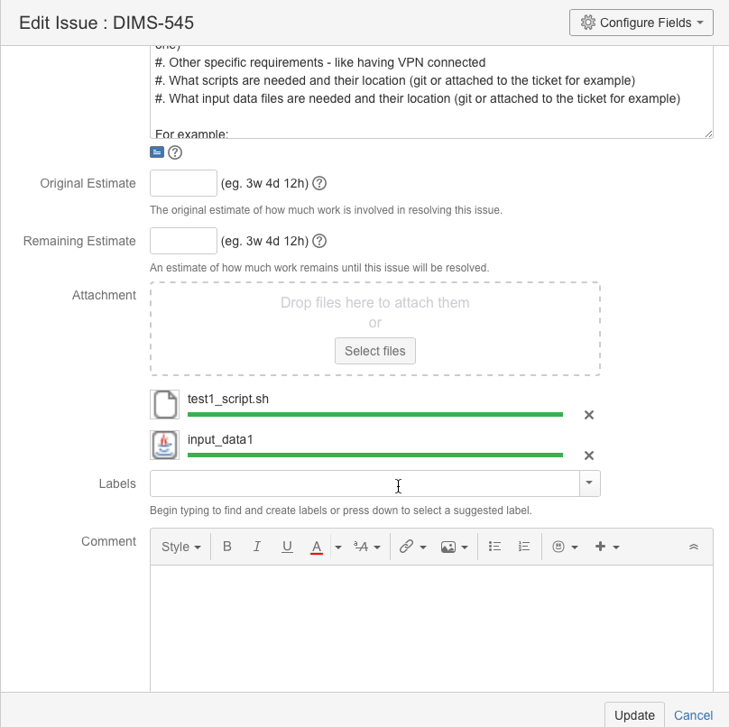

.. _appendices:

Appendices
==========

This appendix describes:

#. How to create a VM for Dashboard server and API component interface tests,
   Dashboard UI-based tests
#. How to create a Tupelo server VM for Tupelo tests
#. How to install Tupelo client
#. How to plan tests with JIRA
#. More to be added...

.. _dashboardtestserver:

Test Dashboard server VM
------------------------

Tests performed using the Dashboard user interface, as well as some of the
automated tests, require a Vagrant test server VM running on the tester's
workstation.

Whenever a test has a prerequisite of ``dashboard test server``, it is
referring to this VM, up and running on the tester's workstation.

Creating the VM
~~~~~~~~~~~~~~~

To create this VM, do the following:

.. _installboxfile:

1. The Vagrant box ``ubuntu-14.04.2-amd64-base-keyed`` should be installed in Vagrant.
   This box is created by the procedure described at :ref:`dimspacker:vmquickstart`.
   If you have already performed those steps, through the subsection
   :ref:`dimspacker:vmquickstartinstallboxes`, then you've already installed
   this box file. You can also check by:

   .. code-block:: none

       vagrant box list

   ..

   If ``ubuntu-14.04.2-amd64-base-keyed`` appears in the list, then you already
   have this box file installed, and you can go to the next step. If it is not
   installed, perform the steps at :ref:`dimspacker:vmquickstart` throught the
   box installation step at :ref:`dimspacker:vmquickstartinstallboxes`.

..

2. Set up Vagrant directory for the VM you're creating. You will need to
   name the VM - the name ``dimstestserver is used in the code below
   and will be used in Test prerequisite steps.
   Then you will add a private IP
   address to the auto-generated Vagrantfile. We are specifying the IP to be used
   for testing as ``192.168.56.103.`` Finally, bring the VM up using ``vagrant up``.

   .. code-block:: none

      cd $GIT/dims-vagrant/ubuntu-14.04.2-amd64/
      make server NAME=dimstestserver
      cd dimstestserver
      ../nic2 192.168.56.103
      vagrant up

   ..

..

3. Run the Ansible playbook ``dims-test-server-provision.yml`` as shown below. This will
   take a while to run since it will install the virtual environmnet. Once this is done, you
   can reuse the VM for multiple tests without destroying it.

   .. code-block:: none

       ./run_playbook -g dashboard-test-servers dims-test-server-provision.yml -vv

   ..

..

Resetting VM Data
~~~~~~~~~~~~~~~~~

A test prerequisite may specify that you reset the test VM's data. To do this, you run
the ``dashboard-test-data-reset`` playbook as follows. CD to the VM's Vagrantfile
directory as shown in the first step if you aren't there already.

.. code-block:: none

    cd $GIT/dims-vagrant/ubuntu-14.04.2-amd64/dimstestserver
    ./run_playbook -g dashboard-test-servers dashboard-test-data-reset.yml -vv

..

.. _creatingtupeloserver:

Creating Tupelo server VM
-------------------------

Tupelo tests require a Tupelo server VM.

This server is created in a similar fashion to the dashboard test server:

1. Make sure you have the box file installed as shown above in step one of creating
   a dashboard test server.

..

2. Set up Vagrant directory for the VM, name it ``tupeloserver`` and
   give it an IP of ``192.168.56.102``.

   .. code-block:: none

      cd $GIT/dims-vagrant/ubuntu-14.04.2-amd64/
      make server NAME=tupeloserver
      cd tupeloserver
      ../nic2 192.168.56.102
      vagrant up

   ..

..

3. Run the Ansible playbook ``tupelo-test-server-provision.yml`` as shown below.

   .. code-block:: none

       ./run_playbook -g tupelo-servers tupelo-server-install.yml -vv

   ..

..

.. _installingtupeloclient:

Installing Tupelo client
------------------------

The tester needs the Tupelo client installed on their host machine to perform many of the Tupelo tests.
The tester installs the tupelo client on his/her developer workstation via Ansible:

.. code-block:: none

    RUNHOST=localhost RUNGROUP=tupelo-clients ansible-playbook -i $GIT/ansible-playbooks/dyn_inv.py $GIT/ansible-playbooks/tupelo-shell-deploy.yml -e artifact_branch=develop --ask-sudo-pass -vv

..

.. _jiratestplanner:

Planning tests with JIRA
------------------------

This section describes how to plan a test cycle and write tests using JIRA.

Test cycle
~~~~~~~~~~

We use a test cycle to plan and execute our tests. To view test cycles,
click ``Tests > Plan Test Cycle``:

..

The list of cycles displays. We need a new cycle for the tests due on
11/15, so we'll create one. Click the ``Create New Cycle`` button to bring up
a dialog to create the cycle. Give it a name and description.

..

The new test cycle displays in the list. You can see that it doesn't have any
tests yet.

..

When you create a test in JIRA, you will add it to this test cycle.

Creating tests
~~~~~~~~~~~~~~

To create a new test, select ``Tests > Create a Test``.

.. figure:: images/jira/create_issue1.png
    :alt: View test cycles
    :width: 100%

..

The Create Issue screen displays, with the issue type already set to Test.
Enter a summary for the test, and fill in choices in the testLevel, testClass, and
qualificationMethod pick boxes. These are described in this Test Plan. Choose one item
per pick box. You should also
add the reference to the DIMS SR - these are referenced in Section 4 of this plan for each
group of planned tests. typeOfData describes where the output data will be when
you are done. You can add this later if you don't know it at this time.

..  todo(lparsons): Update screen shot
.. todo::

    Need to update to screenshot only showing one selection per item

..

The following figure shows the first part of the Create Issue dialog being filled
in:

.. figure:: images/jira/create_issue2.png
    :alt: View test cycles
    :width: 100%

..

Scrolling down, you describe the Environment and provide a Description of the test.
The environment entry should be short. If the test needs a local Vagrant VM to run,
then the Test should reference how that is created in the prerequisites.

We enter prerequisites in the first test step. When you initially create the test, you can just add
a short description and add prerequisites by editing the test.

..

Save the test. You can further fill out fields by editing the test. For example,
you can upload files needed to run the test. In this example, we are uploading a
file with test data and a script which will run a number of automated tests using
the test data file as input:

..

If files aren't attached, the prerequisites should state where to get them.

Add the test to the desired test cycle. Select More Actions > Add to Test Cycle(s):

..

Select the test cycle. In this example, we choose the Sample Test Cycle. You would
choose the 2015-100-15_test_report test cycle for actual tests.

..

The test will now show up in the list of tests for that test cycle. The E button
on the right is the button to click when you are going to execute the test.

.. figure:: images/jira/add_to_test_cycle3.png
    :alt: View test cycles
    :width: 100%

..

To create more tests, you can do so from scratch, or you can clone an existing
test. Go to the existing test, and click Clone.

.. figure:: images/jira/clone_test1.png
    :alt: View test cycles
    :width: 100%

..

Enter a new summary for the new test. You can clone attachments if the same ones
are used for the new test.

.. figure:: images/jira/clone_test2.png
    :alt: View test cycles
    :width: 100%

..

Here is an updated Sample test 2. Prerequisite info has been added to the
description. The comment regarding "if test fails" isn't needed - that was put in
before we had the typeOfOutput field (will update this screenshot later);

Since this test is automated, we just have one step - to run the test script.
The Expected Result is given as how many tests should pass.

.. todo::

    Not sure the best way to do the automated tests in JIRA. In this method, if
    one out of the 12 tests fail, the failing test item isn't shown on the ticket.
    The test output will need to be inspected. (The failed portion could be noted
    in the comments during execution however - see below).

..

.. figure:: images/jira/sample_test_2_updated.png
    :alt: View test cycles
    :width: 100%

..

.. figure:: images/jira/execute_test1.png
    :alt: View test cycles
    :width: 100%

..

.. figure:: images/jira/execute_test2.png
    :alt: View test cycles
    :width: 100%

..

..

.. figure:: images/jira/new_test_execute1.png
    :alt: View test cycles
    :width: 100%

..

.. figure:: images/jira/new_test_execute1.png
    :alt: View test cycles
    :width: 100%

..

